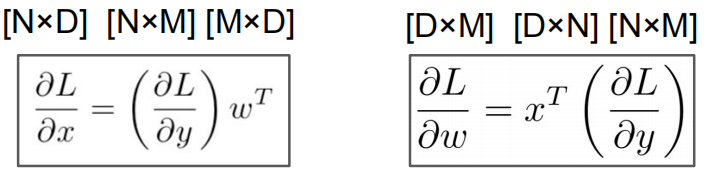
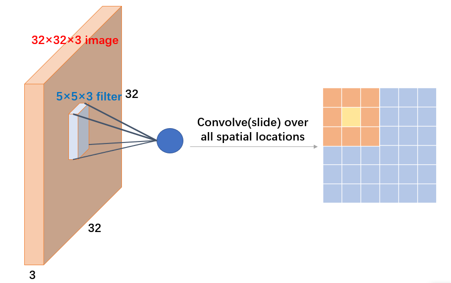
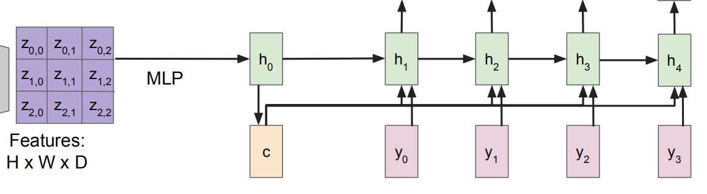
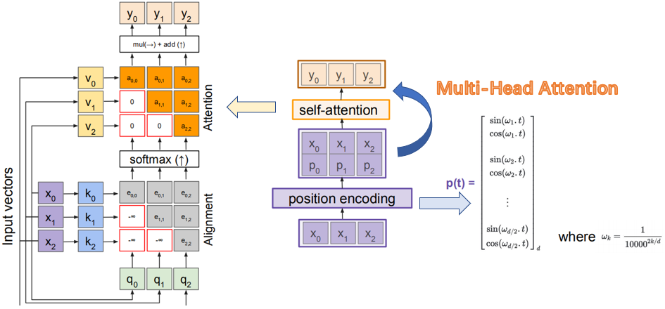
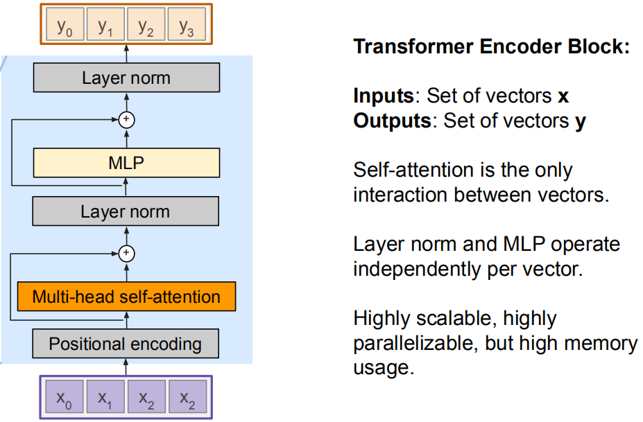
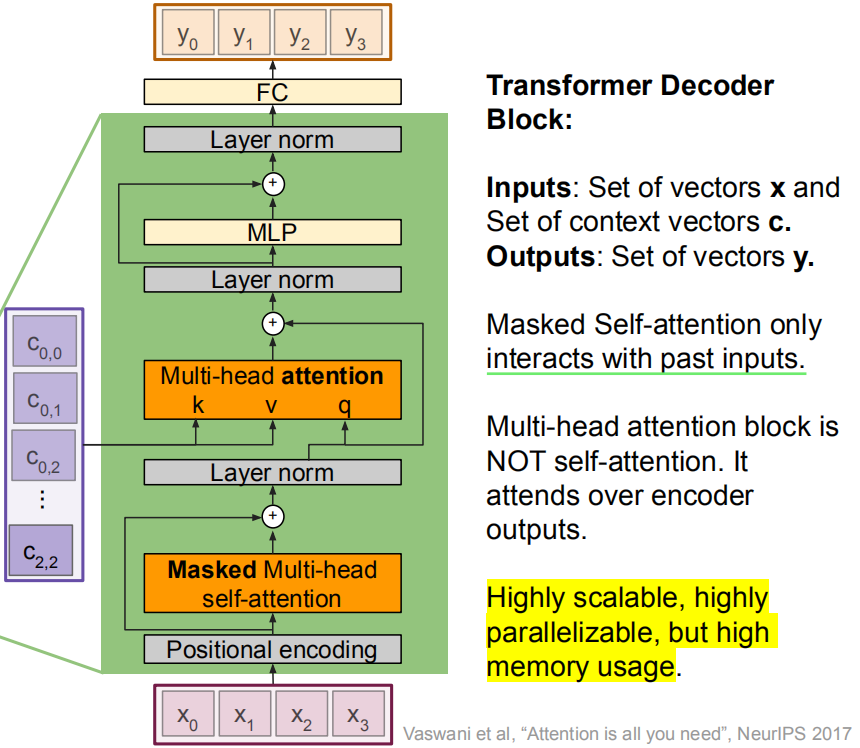
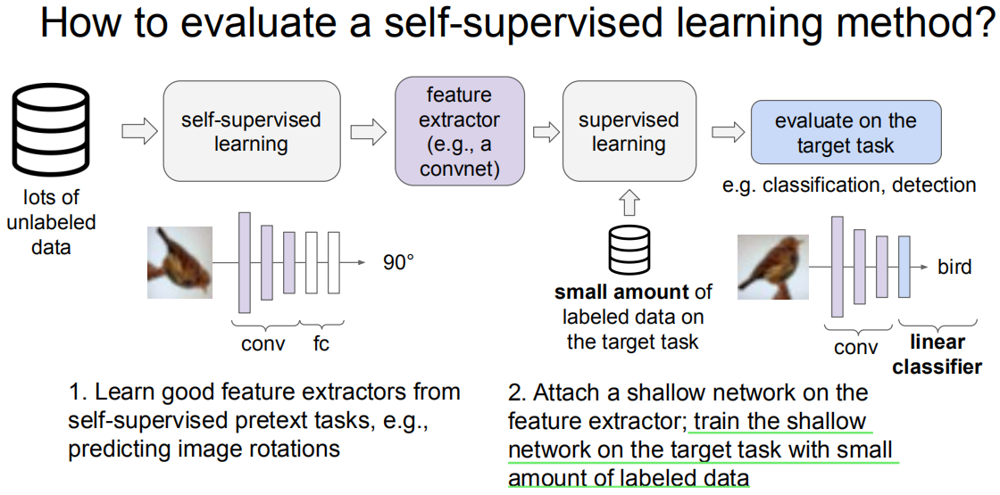
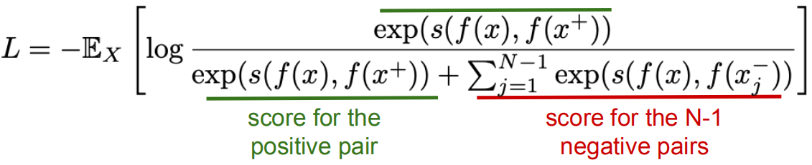
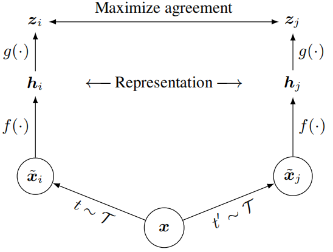
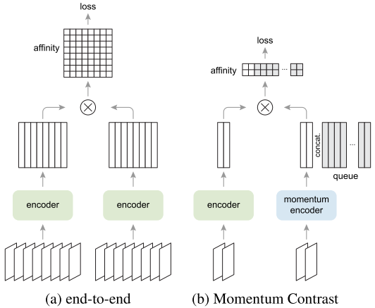

# Convolutional Neural Networks for Visual Recognition
## lecture1-Overview
视觉识别中的核心任务是图像分类，相关任务包括：目标检测、图像标注（Image Captioning）、语义分割、VQA、视觉命令导航、场景图生成

**（sepcial reading）**：Hinton-How to represent part-whole hierarchies in a neural network
GLOM——具有固定架构的神经网络如何将图像解析为部分-整体的层次结构，而每个图像的层次结构又都不同。提出一种解析树的概念，其中的节点由相似向量的island表示，统一了格式塔学派中场的理论来建模感知以及人工智能派别依靠结构描述来建立感知模型。 GLOM 中，一个percept就是一个场，表示整体的共享嵌入向量实际上与表示部分的共享嵌入向量非常不同；GLOM 也有结构描述，解析树中的每个节点都有自己的「地址（address」，但地址位于可能嵌入的连续空间中，而不是硬件位置的离散空间中。

CNN发展历程：1998-CNN到2012-AlexNet；除了recognition，CV研究包括Segmentation、Scene Graphs(图像物体和关系感知)->视觉领域时空场景图

## lecture2-Image Classfication
CV领域中的核心问题之一：图像分类。主要根据计算机识别图像中的像素数字信息。主要存在挑战：
-  Background Clutter：背景的杂乱信息影响主物体的识别
-  Illumination：对于照明不良的物体不易分辨
-  Occlusion：观察存在物体的遮挡
-  Deformation：物体的动作形态造成识别的困难
-  Intraclass variation：内部类别的变化难以通过比较大的特征识别

图像分类可以采用KNN的方法完成分类（非参数、惰性），预测可能需要的时间比较多，根据分类数据量的多少进行划分选择不同的分类算法

## lecture3-Loss Functions and Optimization
定义损失函数-SVM LOSS-->SVM分类器，将线性变换得到的矩阵向量相乘结果作为评价指标
$$
L_i=\sum_{j\not ={y_i}}max(0,s_j-s_{y_i}+1)
$$
- softmax分类器，从三个角度理解全连接层到softmax
  - 加权角度，将权重视为每维特征的重要程度，可以帮助理解L1、L2等正则项
  - 模板匹配角度，可以帮助理解参数的可视化
  - 几何角度，将特征视为多维空间中的点，可以帮助理解一些损失函数背后的设计思想（希望不同类的点具有何种性质）
- 正则化Prevent the model from doing too well on training data，倾向于得到简单的模型
$$
    L=\frac{1}{N}\sum_{i=1}^NL_i+\lambda\sum_kW_k^2
$$
- 梯度下降 梯度的概念 SGD：寻找到最优的权重矩阵W

## lecture4-Neural Networks and Backpropagation
线性分类器存在其弊端，只能区分线性的决策边界，因此针对非线性的图片分类问题，需要对特征进行Transformation——利用神经网络

$$
y=Softmax(w_2*ReLU(w_1*x+b_1)+b_2)
$$

激活函数同样可以采用Sigmoid、tanh、Leaky ReLU
## slights
神经网络通过随机连接同样能够发挥作用：Exploring randomly wired neural networks for image recognition， ICCV 2019

针对复杂的网络如何进行梯度的计算？反向传播
利用链式法则：上游梯度*Local梯度，后续计算过程的梯度乘以当前传播函数的梯度得到下游梯度继续反向传播

$$
\frac{\delta f}{\delta y} = \frac{\delta f}{\delta q}\frac{\delta q}{\delta y}
$$

激活函数sigmoid的反向梯度local gradient：

$$
  \frac{d\sigma(x)}{dx}=\frac{e^{-x}}{(1+e^{-x})^2}=(1-\sigma(x))\sigma(x)
$$

对向量和矩阵的梯度计算：转置进行计算

## lecture5-Convolutional Neural Networks
### history
back-propagation->Gradient-based learning->AlexNet(2012)->ConvNets are everywhere
### architecture
卷积神经网络相当于对图片进行一个filter得到重要的特征信息，在不设置padding的情况下，卷积后的宽度为N-n+1;根据stride的不同以及padding的设置最后的卷积结果都不相同

一般的CNN架构在提取特征后加入激活函数RELU使一部分神经元的输出为0，这样就造成了网络的稀疏性，并且减少了参数的相互依存关系，缓解了过拟合问题的发生，同时引入Pooling使得特征表示更小更易于处理，主要有AVG Pooling和MAX Pooling

## lecture11-attention and Transformer
- Attention with RNNs
  - In Computer Vision
  

    Image Captioning using spatial feature，利用CNN提取特征经过MLP层传递给隐层，每一个隐层信息和输入共同决定输出-->RNN，然后缺点是受制于图片特征c，每次需要对整个图片信息编码进行传递，利用attention每次传递关注图片的不同细节
  - In NLP

    Similar tasks in NLP - Language translation example
- General Attention Layer
  - Self-attention
  - Positional embedding

  
  - Masked attention
  - Multi-head attention
- Transformers 

  Encoder-Decoder架构，每个Encoder由多个block组成
  
  Decoder有两层注意力层，一个是自身的maked self-attention(初始输入是【start】)，一个是上一次输出与Encoder输入的self-attention层
  

## lecture12-Generative Model
## lecture13-Self-Supervised Learning
自监督学习，主要是通过pretext任务获取监督任务所需的特征，来较好地完成下游任务
- Learn with supervised learning objectives, e.g., classification, regression.
- Labels of these pretext tasks are generated automatically

相比于联合学习co-learning，自监督学习一般不关注辅助任务地性能，评估时，而针对下游任务的目标任务评估特征编码器

### 利用图片变换构造辅助任务
- Rotation, inpainting, rearrangement, coloring
### 对比表示学习
- intuition & formulation

$$
  score(f(x),f(x^+))>>score(f(x),f(x^-))
$$

- instance contrastive learning
  - SimCLR
  - MOCO
- SimCLR
  
SimCLR通过在潜在空间中的对比损失来最大化同一数据示例的不同增广视图之间的一致性来学习表示。对同一个图片进行数据增强，构造正样本和负样本，正样本表示相似度接近，负样本表示相似度远离，完成特征提取器$f(·)$的学习

- MOCO（动量对比学习三系列）
- 核心思想：**dictionary as a queue**

MoCo主要设计了三个核心操作：Dictionary as a queue、Momentum update和Shuffling BN。
- 为了避免对比学习中的退化解，需要大量的正样本对和负样本对，传统的end-end方式对GPU显存要求较高，引入对数据特征存储key dictionary的方法，并维护一个queue，减少存储开销；
- 考虑将多个epoch的结果近似到大的epoch，那么要避免梯度的突变，引入momentum update方式来更新key的参数
- 另外，MoCo还发现ResNet里的BN层会阻碍模型学习一个好的特征。由于每个batch内的样本之间计算mean和std导致信息泄露，产生退化解。MoCo通过多GPU训练，分开计算BN，并且shuffle不同GPU上产生的BN信息来解决这个问题。
- MoCo v2 关注SimCLR中的tricks，提高MLP、增强Aug来提升性能；MoCo v3 引入Transformer的backbone来代替SSL中的CNN结构，提高了自监督的问题性能（主要关注存在的问题：ViT作为backbone会导致Self-Supervised的训练过程不稳定，并且这个不稳定现象无法通过最终迁移预测的结果捕捉到。通过fixed random patch projection解决）

### 序列对比学习——对比预测编码（CPC）